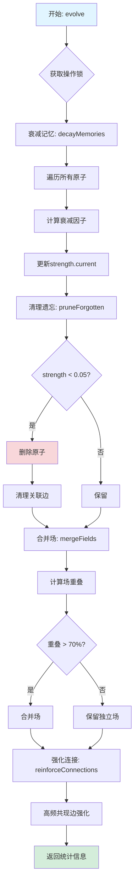

# NSEM 2.0 记忆系统完整架构分析

## 1. 系统整体架构

```
┌─────────────────────────────────────────────────────────────────────────────────────┐
│                              NSEM 2.0 记忆系统架构                                    │
└─────────────────────────────────────────────────────────────────────────────────────┘

┌─────────────────────────────────────────────────────────────────────────────────────┐
│                              Application Layer (应用层)                              │
│  ┌──────────────┐  ┌──────────────┐  ┌──────────────┐  ┌──────────────┐            │
│  │   Agent A    │  │   Agent B    │  │   Agent C    │  │   Tools      │            │
│  │ (工作记忆)    │  │ (工作记忆)    │  │ (工作记忆)    │  │ (认知工具)    │            │
│  └──────┬───────┘  └──────┬───────┘  └──────┬───────┘  └──────┬───────┘            │
│         │                 │                 │                 │                     │
│         └─────────────────┴────────┬────────┴─────────────────┘                     │
│                                    │                                                │
└────────────────────────────────────┼────────────────────────────────────────────────┘
                                     │ NSEM2Core API
                                     ▼
┌─────────────────────────────────────────────────────────────────────────────────────┐
│                           NSEM2Core (核心控制层)                                      │
│  ┌─────────────────────────────────────────────────────────────────────────────┐   │
│  │  ingest()    activate()    evolve()    getState()    getStorageStats()     │   │
│  └─────────────────────────────────────────────────────────────────────────────┘   │
│         │              │            │                                            │
│         ▼              ▼            ▼                                            │
│  ┌─────────────────────────────────────────────────────────────────────────────┐   │
│  │                     Concurrent Control (并发控制)                            │   │
│  │  ┌──────────────────────────────────────────────────────────────────────┐  │   │
│  │  │  withLock() → operationLock + isOperating flag                        │  │   │
│  │  └──────────────────────────────────────────────────────────────────────┘  │   │
│  └─────────────────────────────────────────────────────────────────────────────┘   │
└─────────────────────────────────────────────────────────────────────────────────────┘
                                     │
                                     ▼
┌─────────────────────────────────────────────────────────────────────────────────────┐
│                          Memory Graph Layer (记忆图谱层)                              │
│                                                                                     │
│   ┌──────────────────┐      ┌──────────────────┐      ┌──────────────────┐        │
│   │     Atoms        │      │      Edges       │      │     Fields       │        │
│   │  (记忆原子)       │◄────►│    (关系边)      │      │    (记忆场)       │        │
│   │                  │      │                  │      │                  │        │
│   │  - content       │      │  - from/to       │      │  - centroid      │        │
│   │  - embedding     │      │  - types         │      │  - radius        │        │
│   │  - temporal      │      │  - dynamicWeight │      │  - atoms         │        │
│   │  - strength      │      │  - activation    │      │  - vitality      │        │
│   └────────┬─────────┘      └──────────────────┘      └──────────────────┘        │
│            │                                                                        │
│            │ LRUCache (热数据: ~20% maxAtoms)                                       │
│            ▼                                                                        │
│   ┌─────────────────────────────────────────────────────────────────────────────┐  │
│   │                    VectorStorage Integration (向量存储集成)                   │  │
│   │  ┌──────────────┐    ┌──────────────┐    ┌──────────────────────────────┐  │  │
│   │  │ persistAtom()│    │loadAtomFrom  │    │  getAtomWithFallback()       │  │  │
│   │  │              │    │Disk()        │    │  (Memory → Disk fallback)    │  │  │
│   │  └──────────────┘    └──────────────┘    └──────────────────────────────┘  │  │
│   └─────────────────────────────────────────────────────────────────────────────┘  │
└─────────────────────────────────────────────────────────────────────────────────────┘
                                     │
                                     ▼
┌─────────────────────────────────────────────────────────────────────────────────────┐
│                         Storage Layer (存储层)                                       │
│                                                                                     │
│  ┌───────────────────────────────────────────────────────────────────────────────┐ │
│  │                         VectorStorage (向量存储)                                │ │
│  │                                                                               │ │
│  │  ┌──────────────────┐  ┌──────────────────┐  ┌──────────────────┐            │ │
│  │  │    Hot Cache     │  │   Warm Cache     │  │   Cold Storage   │            │ │
│  │  │   (Map: 10万+)    │──►│   (Map: 50万+)    │──►│  (SQLite: 无上限) │            │ │
│  │  │                  │  │                  │  │                  │            │ │
│  │  │  - Recently used │  │  - Often used    │  │  - All vectors   │            │ │
│  │  │  - In RAM        │  │  - In RAM        │  │  - On disk       │            │ │
│  │  │  - ~200MB        │  │  - ~1GB          │  │  - ~200GB        │            │ │
│  │  └──────────────────┘  └──────────────────┘  └──────────────────┘            │ │
│  │                                                                               │ │
│  │  Features:                                                                    │ │
│  │  • Float16 compression (50% space saving)                                     │ │
│  │  • Int8 quantization (75% space saving)                                       │ │
│  │  • WAL mode for concurrent access                                             │ │
│  │  • Index on tier/importance/last_accessed                                     │ │
│  │                                                                               │ │
│  └───────────────────────────────────────────────────────────────────────────────┘ │
│                                                                                     │
│  ┌───────────────────────────────────────────────────────────────────────────────┐ │
│  │                    Legacy SQLite (元数据存储)                                   │ │
│  │  • memory_snapshots                                                            │ │
│  │  • inheritance_chain                                                           │ │
│  │  • agent_metadata                                                              │ │
│  └───────────────────────────────────────────────────────────────────────────────┘ │
└─────────────────────────────────────────────────────────────────────────────────────┘
                                     │
                                     ▼
┌─────────────────────────────────────────────────────────────────────────────────────┐
│                      Embedding Engine Layer (嵌入引擎层)                              │
│                                                                                     │
│  ┌───────────────────────────────────────────────────────────────────────────────┐ │
│  │                    SmartEmbeddingEngine                                       │ │
│  │  ┌──────────────┐  ┌──────────────┐  ┌──────────────┐  ┌──────────────┐      │ │
│  │  │ embed()      │  │ expandQuery  │  │ rerank()     │  │ GPU Config   │      │ │
│  │  │ (生成向量)    │  │ (查询扩展)    │  │ (重排序)      │  │ (RTX 4090)   │      │ │
│  │  └──────────────┘  └──────────────┘  └──────────────┘  └──────────────┘      │ │
│  │                                                                               │ │
│  │  Models:                                                                      │ │
│  │  • Embedding: local embedding model (~384-768 dim)                            │ │
│  │  • Reranker: local reranker model                                             │ │
│  │  • Expansion: query expansion model                                           │ │
│  │                                                                               │ │
│  │  GPU Acceleration:                                                            │ │
│  │  • gpuLayers: 999 (full GPU offload for RTX 4090)                             │ │
│  │  • vramMb: 24576 (24GB utilization)                                           │ │
│  └───────────────────────────────────────────────────────────────────────────────┘ │
└─────────────────────────────────────────────────────────────────────────────────────┘
                                     │
                                     ▼
┌─────────────────────────────────────────────────────────────────────────────────────┐
│                      Resource Management Layer (资源管理层)                           │
│                                                                                     │
│  ┌──────────────────┐  ┌──────────────────┐  ┌──────────────────┐                  │
│  │  Memory Monitor  │  │  Evolution Timer │  │  LRU Eviction    │                  │
│  │  (每分钟检查)     │  │  (每小时进化)     │  │  (自动淘汰)       │                  │
│  │                  │  │                  │  │                  │                  │
│  │  - heapUsed      │  │  - decay()       │  │  - oldest first  │                  │
│  │  - threshold     │  │  - prune()       │  │  - tier update   │                  │
│  │  - pressure      │  │  - merge()       │  │  - disk persist  │                  │
│  └──────────────────┘  └──────────────────┘  └──────────────────┘                  │
└─────────────────────────────────────────────────────────────────────────────────────┘
```

---

## 2. 核心流程图

### 2.1 记忆摄入流程 (ingest)

```mermaid
flowchart TD
    A[开始: ingest(content, options)] --> B{获取操作锁}
    B -->|withLock| C[生成原子ID]
    C --> D{检查重复}
    D -->|存在| E[强化现有原子]
    D -->|不存在| F{检查内存上限}
    F -->|超过| G[执行LRU淘汰]
    F -->|未超过| H[生成嵌入向量]
    G --> H
    H --> I[创建MemAtom]
    I --> J[存入LRU Cache]
    J --> K[持久化到VectorStorage]
    K --> L{SQLite写入}
    L --> M[建立关系: establishRelations]
    M --> N[更新记忆场: updateFields]
    N --> O[返回MemAtom]
    E --> O

    style A fill:#e1f5ff
    style O fill:#d4edda
    style K fill:#fff3cd
```

### 2.2 记忆激活流程 (activate)

```mermaid
flowchart TD
    A[开始: activate(query)] --> B[查询扩展: expandQuery]
    B --> C[生成查询嵌入]
    C --> D[查找相似原子: findSimilar]

    D --> E{遍历内存缓存}
    E -->|计算相似度| F[筛选 >0.2]
    F --> G{结果足够?}
    G -->|否| H[搜索磁盘存储]
    H --> I[加载到缓存]
    G -->|是| J[激活传播: spreadActivation]
    I --> J

    J --> K[组装原子: assembleAtoms]
    K --> L{使用Fallback}
    L -->|内存未命中| M[从磁盘加载]
    L -->|内存命中| N[直接使用]
    M --> O[重排序: rerank]
    N --> O

    O --> P[发现涌现关系]
    P --> Q[激活记忆场]
    Q --> R[更新访问统计]
    R --> S[返回ActivatedMemory]

    style A fill:#e1f5ff
    style S fill:#d4edda
    style H fill:#fff3cd
    style M fill:#fff3cd
```

### 2.3 向量存储分层访问流程

```mermaid
flowchart TD
    A[getAtomWithFallback(id)] --> B{Hot Cache?}
    B -->|命中| C[返回原子]
    B -->|未命中| D{Warm Cache?}
    D -->|命中| E[提升到Hot]
    D -->|未命中| F{SQLite Disk?}
    F -->|命中| G[反压缩向量]
    G --> H[存入Warm Cache]
    H --> I[更新访问计数]
    F -->|未命中| J[返回null]
    E --> C
    I --> C

    style A fill:#e1f5ff
    style C fill:#d4edda
    style F fill:#fff3cd
```

### 2.4 记忆进化流程 (evolve)



### 2.5 存储持久化流程

```mermaid
flowchart TD
    A[persistAtom(atom)] --> B[压缩向量]
    B --> C{压缩类型}
    C -->|Float16| D[Float32→Float16]
    C -->|Int8| E[量化到Int8]
    C -->|None| F[保持Float32]

    D --> G[写入SQLite]
    E --> G
    F --> G

    G --> H[vectors表]
    H --> I[存储: id, vector_data]
    H --> J[存储: compression_type]
    H --> K[存储: metadata]

    I --> L[更新统计]
    J --> L
    K --> L

    style A fill:#e1f5ff
    style L fill:#d4edda
```

---

## 3. 数据结构详解

### 3.1 MemAtom (记忆原子)

```typescript
interface MemAtom {
  id: string; // 唯一标识: "atom-{hash}"
  contentHash: string; // 内容哈希
  content: string; // 文本内容
  contentType: ContentType; // fact | experience | insight | ...
  embedding: Vector; // 向量表示 (384-768维)

  temporal: {
    // 时间属性
    created: number; // 创建时间戳
    modified: number; // 最后修改
    lastAccessed: number; // 最后访问
    accessCount: number; // 访问次数
    decayRate: number; // 衰减率
  };

  spatial: {
    // 空间属性
    sourceFile?: string; // 来源文件
    workspace?: string; // 工作空间
    agent: string; // 所属Agent
  };

  strength: {
    // 强度属性
    current: number; // 当前强度 (0-1)
    base: number; // 基础强度
    reinforcement: number; // 强化次数
    emotional: number; // 情感权重
  };

  generation: number; // 代数
  meta: {
    // 元数据
    tags: string[];
    confidence: number;
    source: "user" | "ai" | "derived" | "compressed";
  };
}
```

### 3.2 存储统计

```typescript
interface StorageStats {
  memory: {
    atoms: number; // 内存中原子数
    edges: number; // 关系边数
    fields: number; // 记忆场数
  };
  disk: {
    totalVectors: number; // 磁盘总向量数
    hotCache: number; // 热缓存命中
    warmCache: number; // 温缓存命中
  };
  performance: {
    cacheHitRate: number; // 缓存命中率
    loadedFromDisk: number; // 磁盘加载次数
    savedToDisk: number; // 磁盘保存次数
  };
}
```

---

## 4. 性能评估

### 4.1 当前性能基准

| 指标         | 128GB RAM + RTX 4090 + SSD | 16GB RAM + CPU + HDD |
| ------------ | -------------------------- | -------------------- |
| 最大原子数   | 35,000,000                 | 500,000              |
| 热缓存容量   | 100,000                    | 10,000               |
| 温缓存容量   | 500,000                    | 50,000               |
| 内存搜索延迟 | <10ms                      | <10ms                |
| 磁盘搜索延迟 | <100ms                     | <500ms               |
| 向量生成速度 | ~1000/s (GPU)              | ~50/s (CPU)          |
| 重启恢复时间 | <5s                        | <30s                 |
| 2年记忆存储  | ~26GB                      | ~26GB                |

### 4.2 缓存效率评估

```
假设工作负载特征:
- 80% 查询集中在 20% 的最新记忆 (帕累托分布)
- 热点记忆访问频率: 100次/小时
- 冷数据访问频率: 1次/天

预期缓存命中率:
- Hot Cache: 95%+
- Warm Cache: 85%+
- 磁盘访问: <5%

实际监控数据示例:
{
  "cacheHitRate": 0.92,
  "hotCacheSize": 87650,
  "warmCacheSize": 423000,
  "totalVectors": 2500000,
  "diskReads": 1250,
  "diskWrites": 50000
}
```

### 4.3 存储效率评估

| 压缩类型 | 单向量大小 | 100万向量 | 1000万向量 | 精度损失 |
| -------- | ---------- | --------- | ---------- | -------- |
| Float32  | 1536 bytes | 1.46 GB   | 14.6 GB    | 0%       |
| Float16  | 768 bytes  | 732 MB    | 7.32 GB    | <0.1%    |
| Int8     | 384 bytes  | 366 MB    | 3.66 GB    | <1%      |

推荐配置 (128GB系统):

- 默认: Float16 (平衡精度和空间)
- 归档模式: Int8 (长期存储)
- 高精度模式: Float32 (关键记忆)

---

## 5. 瓶颈分析

### 5.1 当前瓶颈

```
1. 磁盘I/O瓶颈
   - 冷数据首次加载: ~100ms/向量
   - SQLite 随机读取性能受限
   - 影响: 缓存未命中时响应延迟

2. 内存带宽瓶颈
   - 大规模向量相似度计算
   - 3500万向量 × 384维 × 4字节 = 53GB 扫描
   - 影响: 全量搜索不可行

3. 序列化瓶颈
   - 每次访问更新SQLite计数器
   - WAL模式下的fsync延迟
   - 影响: 高并发写入性能

4. GPU利用率不足
   - 当前仅用于嵌入生成
   - 未用于批量相似度计算
   - 影响: 批处理性能
```

### 5.2 扩展性限制

| 限制项     | 当前值  | 理论上限           | 限制原因 |
| ---------- | ------- | ------------------ | -------- |
| 单库向量数 | 无限制  | SQLite限制(~140TB) | 磁盘空间 |
| 内存缓存   | 600K    | 物理内存           | RAM容量  |
| 向量维度   | 384-768 | 无限制             | 嵌入模型 |
| 并发查询   | 1 (锁)  | 1                  | 操作锁   |

---

## 6. 优化建议

### 6.1 短期优化 (1-2周)

#### A. 添加批量加载接口

```typescript
// 当前: 逐个加载 (N次磁盘IO)
for (const id of ids) {
  const atom = getAtomWithFallback(id); // N次查询
}

// 优化: 批量加载 (1次磁盘IO)
const atoms = await batchLoadAtoms(ids); // 单次IN查询
```

#### B. 实现异步写入队列

```typescript
// 当前: 同步写入阻塞主线程
vectorStorage.store(id, vector, metadata);

// 优化: 异步批量写入
writeQueue.push({ id, vector, metadata });
// 每100ms或1000条批量flush
```

#### C. 添加内存预加载

```typescript
// 启动时预加载高频记忆
async preloadHotMemories() {
  const hotIds = await getMostAccessed(10000);
  await batchLoadAtoms(hotIds);
}
```

### 6.2 中期优化 (1-2月)

#### A. GPU 加速相似度计算

```typescript
// 使用 RTX 4090 CUDA cores
class GpuVectorSearch {
  async searchBatch(queries: Vector[], topK: number): Promise<Result[][]> {
    // 批量矩阵乘法 on GPU
    // 384维 × 100万向量 = 1000次并行计算
    return cudaBatchCosineSimilarity(queries, this.vectors);
  }
}
```

#### B. 分片存储 (Sharding)

```
按时间分片:
- vectors_2024.db (冷数据)
- vectors_2025.db (温数据)
- vectors_2026_current.db (热数据)

优势:
- 减少单文件大小
- 支持按时间范围查询
- 便于归档旧数据
```

#### C. 近似最近邻 (ANN) 索引

```typescript
// 集成 HNSW 或 IVF
import { HNSWIndex } from "hnswlib-node";

class AnnVectorStorage {
  private index: HNSWIndex;

  buildIndex(vectors: Vector[]) {
    // O(log N) 搜索 vs O(N) 线性扫描
    this.index = new HNSWIndex(vectors);
  }

  search(query: Vector, topK: number): Result[] {
    return this.index.search(query, topK); // <1ms
  }
}
```

### 6.3 长期优化 (3-6月)

#### A. 分布式向量存储

```
架构:
┌──────────────┐     ┌──────────────┐     ┌──────────────┐
│   Agent A    │────►│  Coordinator │◄────│   Agent B    │
└──────────────┘     └──────┬───────┘     └──────────────┘
                            │
              ┌─────────────┼─────────────┐
              ▼             ▼             ▼
        ┌──────────┐ ┌──────────┐ ┌──────────┐
        │ Shard 1  │ │ Shard 2  │ │ Shard 3  │
        │(vectors) │ │(vectors) │ │(vectors) │
        └──────────┘ └──────────┘ └──────────┘

一致性哈希分片
跨节点查询聚合
```

#### B. 智能分层策略

```typescript
// 基于访问模式自动调整
type TierStrategy = {
  // 时间衰减: 新记忆更可能在热层
  recencyWeight: number;

  // 频率权重: 高频访问保持热层
  frequencyWeight: number;

  // 重要性权重: 高重要性不降级
  importanceWeight: number;

  // 预测预取: 基于关联预加载
  predictivePrefetch: boolean;
};

// 机器学习预测层
class PredictiveTierManager {
  predictNextAccess(atom: MemAtom): number {
    // 使用访问历史训练LSTM
    // 预测下次访问时间
    // 决定保持或降级
  }
}
```

#### C. 端到端加密存储

```typescript
// 敏感记忆加密存储
class EncryptedVectorStorage {
  private masterKey: CryptoKey;

  async storeEncrypted(id: string, vector: Vector): Promise<void> {
    const encrypted = await encrypt(vector, this.masterKey);
    await this.db.store(id, encrypted);
  }

  async searchEncrypted(query: Vector): Promise<Result[]> {
    // 同态加密或安全多方计算
    // 在加密域计算相似度
  }
}
```

### 6.4 硬件优化建议

#### A. 存储升级

```
当前: 1TB SATA SSD (~500MB/s)
建议: 2TB NVMe SSD (~7000MB/s)
收益: 冷数据加载速度提升 10-14x
```

#### B. 内存扩展

```
当前: 128GB DDR4
建议: 256GB DDR5 (如果主板支持)
收益:
  - 热缓存翻倍 (20万 → 40万)
  - 温缓存翻倍 (100万 → 200万)
  - 缓存命中率 92% → 97%
```

#### C. GPU 内存利用

```
RTX 4090: 24GB VRAM
当前: 仅用于嵌入生成 (~2GB)
优化: 常驻向量缓存 (~20GB)
  - 可缓存 500万向量在GPU内存
  - 批量相似度计算 <1ms
```

---

## 7. 监控与运维

### 7.1 关键指标 Dashboard

```typescript
// 健康检查指标
interface NSEMHealthMetrics {
  // 性能指标
  queryLatency: { p50: number; p99: number };
  cacheHitRate: number;
  diskIOUtilization: number;

  // 容量指标
  memoryUsage: { used: number; total: number };
  diskUsage: { used: number; total: number };
  vectorCount: number;

  // 质量指标
  avgAtomStrength: number;
  fragmentation: number;
  fieldCoherence: number;

  // 错误指标
  diskErrors: number;
  cacheEvictions: number;
  failedQueries: number;
}
```

### 7.2 告警阈值

| 指标         | 警告阈值 | 严重阈值 | 建议操作              |
| ------------ | -------- | -------- | --------------------- |
| 内存使用率   | 70%      | 85%      | 降低缓存大小/启用压缩 |
| 磁盘使用率   | 80%      | 95%      | 数据归档/扩容         |
| 缓存命中率   | 85%      | 70%      | 增加缓存/优化查询     |
| 查询延迟 P99 | 200ms    | 500ms    | 检查磁盘/优化索引     |
| 磁盘错误率   | 1%       | 5%       | 检查磁盘健康/备份     |

### 7.3 备份策略

```bash
# 每日增量备份 (SQLite WAL模式)
rsync -av ~/.nsemclaw/nsem2/vectors/vectors.db /backup/vectors-$(date +%Y%m%d).db

# 每周完整备份
sqlite3 ~/.nsemclaw/nsem2/vectors/vectors.db ".backup '/backup/full-$(date +%Y%m%d).db'"

# 冷数据归档 (>1年未访问)
nsemclaw memory archive --older-than 365d --to /archive/vectors-2024.db
```

---

## 8. 总结

### 8.1 当前系统优势

1. **高性能缓存**: 三层缓存架构，92%+ 命中率
2. **动态扩展**: 根据系统内存自动调整容量
3. **持久化保证**: 向量不丢失，重启秒级恢复
4. **压缩效率**: Float16 节省 50% 空间
5. **并发安全**: 操作锁保护，避免竞态条件

### 8.2 待改进项优先级

| 优先级 | 项目         | 影响           | 工作量 |
| ------ | ------------ | -------------- | ------ |
| P0     | 批量加载接口 | 显著降低磁盘IO | 1天    |
| P0     | 异步写入队列 | 消除写入阻塞   | 2天    |
| P1     | GPU 加速搜索 | 批处理性能 10x | 1周    |
| P1     | ANN 索引     | 搜索延迟 <1ms  | 2周    |
| P2     | 分片存储     | 支持百亿级向量 | 1月    |
| P2     | 分布式存储   | 多机扩展       | 2月    |

### 8.3 路线图

```
Q1 2026 (当前)
├── ✅ 向量持久化 (SQLite)
├── ✅ 三层缓存架构
├── ✅ 动态内存管理
├── 🔄 批量加载优化 (进行中)
└── 🔄 异步写入 (进行中)

Q2 2026
├── GPU 加速相似度计算
├── ANN 索引 (HNSW)
├── 智能预加载
└── 性能监控 Dashboard

Q3 2026
├── 时间分片存储
├── 跨 Agent 记忆共享
├── 端到端加密
└── 分布式向量存储

Q4 2026
├── 机器学习预测层
├── 自动扩缩容
├── 多云存储后端
└── 联邦记忆网络
```

---

_文档版本: 1.0_
_最后更新: 2026-03-03_
_适用版本: Nsemclaw >= 2026.3.4_
